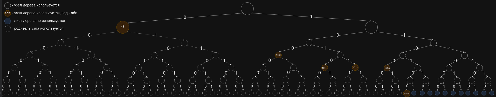
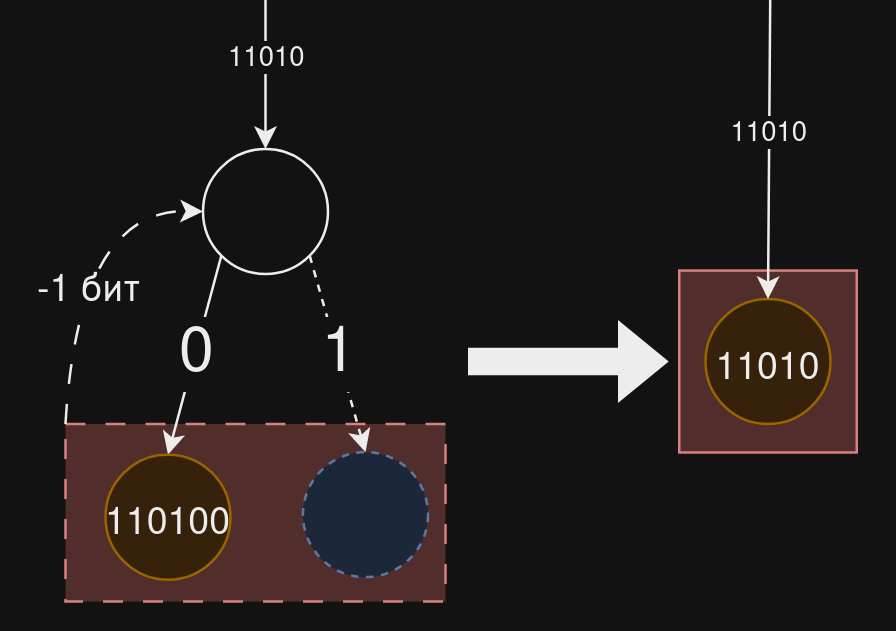
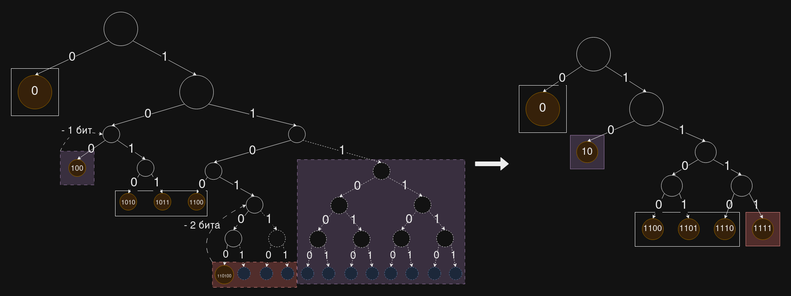

# Основа

В [работе](./said_2004.pdf) Амира Саида предлагается найти оптимальное разбиение алфавита
на Н_г групп. Поиск оптимального разбиения осуществляется с помощью рекурсии, для чего вычисляются все
(в оптимизированном варианте их число сокращается) возможные варианты разбить алфавит на Н_г групп.
Потом вычисляется оптимальное разбиение для числа групп, где средняя длина символа в битах получилась минимальной.

## Отличие моей идеи

Я хочу вместо перебора всех возможных Н_г, меньших длины алфавита, ограничить их сверху.

Рассмотри на примере: пусть есть текст из 10000 символов, рассчитаем для него энтропию и коды по алгоритму Хаффмана

| символы             | а    | б    | в    | г    | д    | е    |
|---------------------|------|------|------|------|------|------|
| количество символов | 5000 | 2000 | 1000 | 900  | 900  | 200  |
| коды символов       | 1    | 01   | 0000 | 0001 | 0010 | 0011 |

Энтропия равна ~2.03 (ограничение средней длины кодового слова снизу).

По алгоритму Хаффмана получаем среднюю длину символа 2.1

Вычислим вероятности символов и логарифм вероятности по основанию 2

| символы              | а   | б     | в     | г     | д     | е     |
|----------------------|-----|-------|-------|-------|-------|-------|
| вероятности символов | 1/2 | 1/5   | 1/10  | 9/100 | 9/100 | 1/50  |
| логарифм вероятности | -1  | -2.32 | -3.32 | -3.47 | -3.47 | -5.64 |

Округлим логарифмы в меньшую сторону, домножим на -1, чтобы получить длину символов в битах

| символы              | а  | б  | в  | г  | д  | е  |
|----------------------|----|----|----|----|----|----|
| округленный логарифм | -1 | -3 | -4 | -4 | -4 | -6 |
| длина в битах        | 1  | 3  | 4  | 4  | 4  | 6  |

На основе данной таблицы можно разбить алфавит на 4 группы.

| Символы                      | а | б   | в   | г   | д   | е      |
|------------------------------|---|-----|-----|-----|-----|--------|
| Группа из символов           | а | б   | вгд | вгд | вгд | е      |
| Префикс группы               | 0 | 100 | 1   | 1   | 1   | 110100 |
| Кодовое слово внутри группы  | - | -   | 010 | 011 | 100 | -      |

Код символа - конкатенация префикса группы и кодового слова внутри группы.
Например, у буквы "а" - это "0" + "" = "0", у буквы "в" - это "1" + "010" = "1010".

Однако назначить символам такие длины - значит получить среднюю длину символа 2.34,
что на 11% больше средней длины по Хаффману.
Попробуем сгруппировать символы более оптимально.

### Оптимизация разбиения по частотам

Для наглядности составим таблицу, где длинам символов сопоставим количество символов данной длины и
неиспользуемое количество символов данной длины.

| длина в битах                                         | 1 | 2 | 3 | 4 | 5 | 6 |
|-------------------------------------------------------|---|---|---|---|---|---|
| количество символов с указанной длиной                | 1 | 0 | 1 | 3 | 0 | 1 |

Если мы используем не более n бит для записи символов, то мы можем с их помощью записать не более 2^n символов. 
Если мы один из символов запишем с помощью 1 бита, то нам останется не (2^n) - 1 вариант символов, а 2^(n - 1), 
т.к. символ, записанный одним битом, например "0", является префиксом для 2 символов по 2 бита("00" и "01"), 
4 символов по 3 бита("000", "001", "010", "011"), ... 2^(n - 1) символов по n бит.

Т.к. максимальная длина в нашем случае - 6 бит, то каждому длине L каждого символа сопоставим число "занятых" им 
кодовых слов по 6 бит длиной - 2^(6 - L), и найдем сколько кодовых слов "занял" весь алфавит.

| L                                      | 1  | 2  | 3 | 4  | 5 | 6 |
|----------------------------------------|----|----|---|----|---|---|
| количество символов с указанной длиной | 1  | 0  | 1 | 3  | 0 | 1 |
| 2^(6 - L)                              | 32 | 16 | 8 | 4  | 2 | 1 |
| количество "занятых" кодовых слов      | 32 | 0  | 8 | 12 | 0 | 1 |

Итого занято 53 кодовых слова длины 6. Соответственно, "остается" еще 64 - 53 = 11 кодовых слов. 
Значит, можно "занять" кодовое слово меньшей длины для некоторых символов.

Для большей наглядности можно построить дерево на основе данных кодов: 

Для уменьшения длины L кодового слова на 1 бит, надо чтобы "оставалось" 2^(6 - L) кодовых слов, на 2 бита - 
3 * 2^(6 - L), ... на n бит - (2^n - 1)(2^(6 - L)). 

Визуализация уменьшения длины на 1 для кодового слова 110100: 

В нашем случае остается 11 кодовых слов, которые можно представить в виде 8 + 3 или 4 + 4 + 3. 
Т.к. 3 есть в обоих вариантах, мы в любом случае уменьшаем самого редкого длину символа с 6 до 4.
Т.к. вероятность у него 0.02, то средняя длина символа уменьшается на (6 - 4) * 0.02 = 0.04 бита
Теперь сравним что лучше: уменьшение длины "б" с 3 до 2 или уменьшение длины "в" и "г" с 4 символов до 3.
Вместо "г" можно "д", т.к. у них равные вероятности, это не повлияет на среднюю длину символа.
Средняя длина символа при уменьшении длины "б" уменьшается на (3 - 2) * 0.2 = 0.2 бита
Средняя длина символа при уменьшении длин "в" и "г" уменьшается на (4 - 3) * (0.1 + 0.09) = 0.19 бита
Лучше уменьшить длину символа "б". В таком случае средняя длина символа будет равна 2.34 - 0.04 - 0.2 = 2.1

Визуализация оптимизации (в пунктирных прямоугольниках применяется оптимизация и длина кодового слова сокращается, 
в прямоугольниках со сплошной границе длина кодового слова остается прежней, но значение может поменяться): 

Итого мы получаем разбиение на 3 группы. Средняя длина символа такая же как у алгоритма Хаффмана, 
а длина записи алфавита уменьшается: вместо пар "символ - кодовое слово" будут пары "группа - префикс".

На данный момент не посчитана сложность идеи.

---

#  Оптимизация записи

Сложность реализации и выгода от применения представленных в этом разделе идей пока не посчитаны.

## Группировка символов

Небольшими и большими сообщениями будут называться объемы информации размер, которых относительно небольшой 
(например, 100 символов - сообщение в мессенджере) или относительно большой (например, миллион символов - книга).
Конкретных порогов небольших/больших сообщений на данный момент привести нельзя, это зависит от применяемого алгоритма
сжатия. 

При передаче небольших сообщений нам требуется вначале записать какому кодовому слову соответствует какой символ и 
только потом передавать сам закодированный текст. Отметим, что это работает с сообщениями, где символы встречаются чаще 
1 раза. 
При разбиении на группы мы экономим на длине кодового слова - записываем его префикс один раз для группы из n слов, 
вместо того, чтобы писать его полностью для каждого из n слов. 
Это незначительно уменьшает длину "заголовка" с кодовыми словами для больших сообщений, но для небольших сообщений 
разница может оказаться значительной. 

## Сообщения из уникальных символов
Стоит отметить что для сообщений, где все символы встречаются по 1 разу, не подойдет сжатие заменой на кодовые слова, 
т.к. в закодированном сообщении будут перечислены символы сообщения + кодовые слова дважды (заголовок + текст). 
Зато для сообщений из нескольких уникальных символов можно использовать факт, что все символы могут начинаться с 
одинакового префикса (например, латиница в нижнем регистре в ASCII записана как 011ХХХХХ) :
1. вычисляем какой префикс в бинарном представлении у всех символов одинаковый
2. пишем в начале сообщения какое-то служебное слово, чтобы было понятно, что далее записаны символы, которые 
   - должны занимать N байт/записаны в определенной кодировке(длина символов в кодировке может отличаться, но префикс 
   все равно может совпадать)
   - занимают K бит, т.к. не содержат одинакового для всех префикса **P**
   - в оригинальной кодировке начинаются с префикса **P**
3. Записываем сообщение в закодированном виде.

Данная идея очень похожа на обычную группировку символов, но вместо записи самих символов в заголовке мы пишем 
служебное слово. Соответственно, мы получим выгоду от такого подхода, только в том случае, если длина оригинального 
сообщения больше, чем длина служебного слова + закодированного сообщения.

## Добавление избыточности

Более того, в отдельных случаях можно пожертвовать длиной записи кодового слова и увеличить ее, 
чтобы поместить кодовое слово в группу к символам с большей длиной.
Пример: пусть
- символ "а" встречается в тексте 2 раза, а длина его кодового слова 6 бит, других слов такой длины нет
- символов, которые встречаются 2 раза или реже, 15(или меньше) и их длина составляет 7 бит.
Сравним насколько увеличивается длина закодированного сообщения при кодировании "а" с помощью 6 и 7 бит - 
сложим длину записи кодового слова для "а" и длину его написания в тексте.

|                  | кодируем "а" 6 битами | кодируем "а" 7 битами            |
|------------------|-----------------------|----------------------------------|
| Длина сообщения  | 6 + 2 * 6 = 18        | (7 - log_2(15 + 1)) + 2 * 7 = 17 |

Данный прирост невелик. Вряд ли получится на этом сэкономить большое количество бит, т.к. длина слов, 
которые встречаются 1 раз и не входят в группу с большим количеством символов минимальна, если не примерен 
[мой подход](#оптимизация-разбиения-по-частотам). 
Тем не менее прирост есть, как показано на примере, значит его следует посчитать. Правда, вероятно вывод будет 
"ради результата в пару бит при очень удачном стечении обстоятельств не стоит заморачиваться и усложнять алгоритм".

